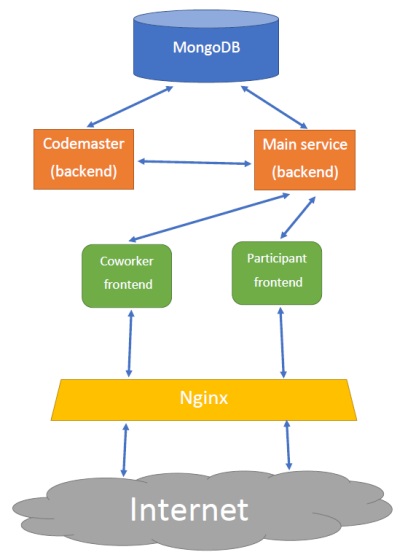

# Coursework description

The goal of the coursework is to enable student to show what was studied during the course. Coursework has two parts: obligatory and optional. <br> 
Completing optional part allows to show how brilliant student is. We suggest toolset which can be used to complete obligatory part, but student is free to use any tools.

Each student is provided with source code of `T-Challenge` application with enough explanation how to run the application.

Completing mandatory part means that student will accomplish the following:
* dockerize each of application' services
* run application on Kubernetes platform
* create simple smoke integration test
* at least two separated environments (dev/prod) should exist and it should pe possible to transfer application code from one environment to another
* create all necessary CI/CD stuff for dockerization and deployment 

Options for non-mandatory part(list is not exhaustive):
* Use Helm (or a like) for application packet management
* Use kustomize (or a like) for application templating 
* Use Ansible for provisioning something
* Use tls-secured communication between services
* Use any logging/monitoring solution

# T-Challenge: Service
Rest service for T-Challenge clients.

See this service on the whole T-Challenge scheme (named "Main service"):


## Database
Application requires a MongoDB instance running.

Tested on MongoDB server version: `4.2.1` running as Docker container.

Database `tchallenge` should be created (i.e. [MongoDB Compass](https://www.mongodb.com/products/compass) can be used)

Database user and password should be created:

```shell
$ mongo
> use admin
> db.createUser(
    {
    user: "username",
    pwd: "password",
    roles: [ { role: "readWrite", db: "tchallenge" } ]
    }
 )
```

### Data for smoke test

In database `tchallenge` create collection `accounts` and insert this document:

```json
 {
    "_id": {
        "$oid": "5b927bef3c30463164dbfb40"
    },
    "email": "user@user.com",
    "passwordHash": "$2a$10$wJWbvG77RDEJp90KzTHxfure.84Ee4HbA6L0w/a1v40ArXR8N/CtK",
    "category": "PARTICIPANT",
    "roles": ["PARTICIPANT"],
    "status": "APPROVED",
    "personality": {
        "firstname": null,
        "lastname": null,
        "middlename": null,
        "quickname": "User"
    },
    "participantPersonality": {
        "essay": null,
        "linkedin": null,
        "hh": null,
        "github": null,
        "bitbucket": null,
        "website": null
    },
    "registeredAt": {
        "$date": "2018-07-07T11:07:56.063Z"
    },
    "createdAt": {
        "$date": "2018-07-07T11:07:56.063Z"
    },
    "lastModifiedAt": {
        "$date": "2018-07-07T11:07:56.063Z"
    }
}
```

## Configuration

Application uses default properties, but you can specify yours using environment variables

```shell
# mandatory
TCHALLENGE_SERVICE_BACKEND_PORT='4567'
TCHALLENGE_SERVICE_PARTICIPANT_URL='http://localhost:4200'

## database (also mandatory)
TCHALLENGE_MONGODB_HOST='localhost'
TCHALLENGE_MONGODB_PORT='27017'
TCHALLENGE_MONGODB_USERNAME='username'
TCHALLENGE_MONGODB_PASSWORD='password'
TCHALLENGE_MONGODB_DATABASE='tchallenge'

# optional
TCHALLENGE_EXPERIMENTAL_FEATURES_ENABLED='true'
TCHALLENGE_MAIL_SERVER='localhost'
TCHALLENGE_MAIL_USERNAME='info@t-challenge.ru'
TCHALLENGE_SENDGRID_ENABLED='false'
TCHALLENGE_SENDGRID_APIKEY='your_api_key'
TCHALLENGE_PROXY_HOST='proxy'
TCHALLENGE_PROXY_PORT='3128'
```
Some settings defined here: `source\src\main\resources\application.yml`

## Run 

Tested on `openjdk version 1.8.0_222` and `Gradle 5.5.1`

### Locally

Run gradle task:
```shell
> cd source
> gradle bootRun
```
and then application can be accessed on http://localhost:4567

## Smoke test

Run [postman](https://www.postman.com/) request from this postman collection:
```json
{
	"info": {
		"_postman_id": "ccbbda8a-9081-435f-9870-ea84c5a0a0f3",
		"name": "t-challenge",
		"schema": "https://schema.getpostman.com/json/collection/v2.1.0/collection.json"
	},
	"item": [
		{
			"name": "Get token",
			"request": {
				"method": "POST",
				"header": [],
				"body": {
					"mode": "raw",
					"raw": "{\n\t\"method\" : \"PASSWORD\",\n    \"email\" : \"user@user.com\",\n    \"password\" : \"12345\"\n}",
					"options": {
						"raw": {
							"language": "json"
						}
					}
				},
				"url": {
					"raw": "http://localhost:4567/security/tokens/",
					"protocol": "http",
					"host": [
						"localhost"
					],
					"port": "4567",
					"path": [
						"security",
						"tokens",
						""
					]
				}
			},
			"response": []
		}
	],
	"protocolProfileBehavior": {}
}
```

and you should recieve token like this:
```json
{
    "id": "411590e0-9317-4c5a-9d49-83a5482de096",
    "accountId": "5b927bef3c30463164dbfb40",
    "payload": "6595e971-e9ef-4c4e-84b8-867b0e60da43",
    "createdAt": "2020-04-22T04:13:34.843Z",
    "accountCategory": "PARTICIPANT",
    "roles": [
        "PARTICIPANT"
    ],
    "validUntil": "2020-04-22T05:13:34.843Z",
    "expired": false
}
``` 

